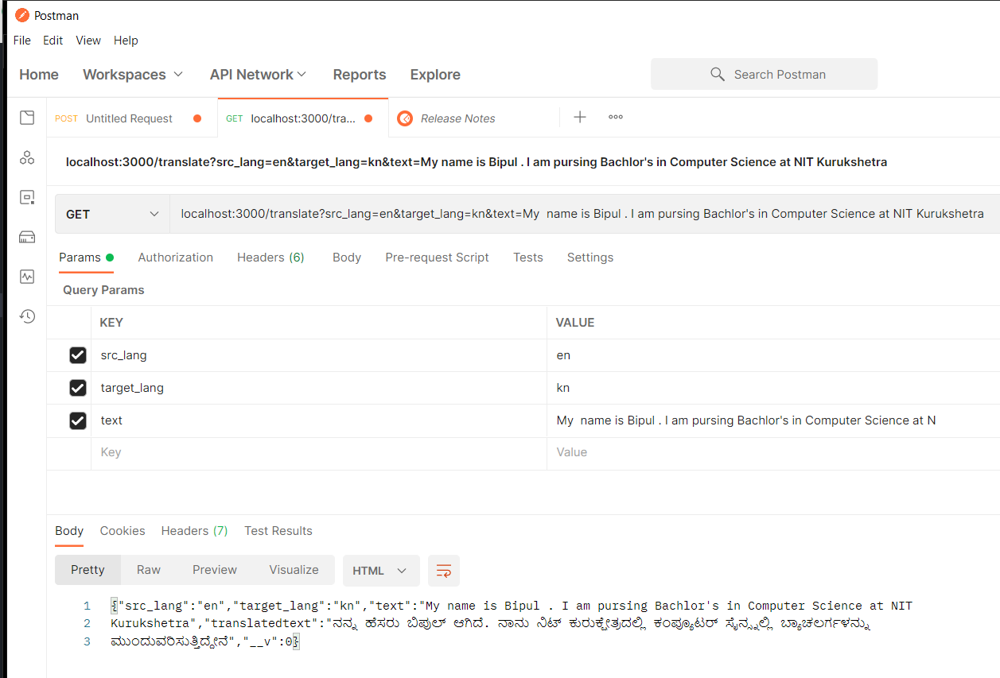
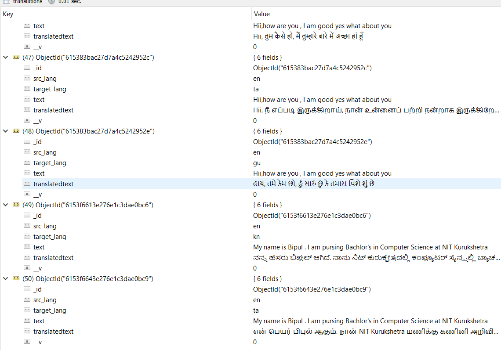
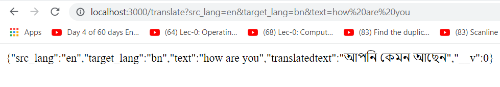
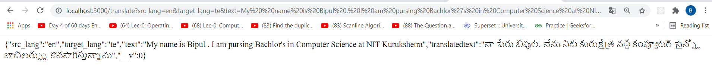

# Translation smartCaching

## Target

Create a web server to translate a text from one language to another.

### Task
- Create a web server with a RESTful API to translate a text from one language to another.
- For the actual translation, an external service like Google Translate can be used.
- The source and target language should be definable via the API.
- In addition, cache (store in Database) translations, in order to avoid repeated hits to the translation API. The
cache must be persistent!
- The server should have an extensible architecture.
E.g. We may want to change our caching strategy or switch out our
translation service.

### Bonus Tasks
As a bonus task, implement smart pre-caching. This means we assume that if a user translates a text into Kannada, he is
likely to also translate the same text to Hindi. Therefore we want to not only request Kannada from the external service
but also other languages like Hindi, Tamil, etc. and store it in our cache.
The smart caching should not affect the response time of the translation API

## Requirements

1. Node
2. MongoDB
3. VS Code or Atom

### Tech stack used
-  `NodeJS` & `ExpressJS` (a flexible Node.js web application framework) as beckend.
-  `Google translate` as an external service for actual translation.
-   ` MongoDB `: Database for storing translations

## Install Dependencies

```
npm install
```

## Run the app
- Define the port number in index.js (I have set it 3000 as of now)
-  first run the `mongod`
- Run index.js with following command
    `node index.js` or `nodemon index.js`
 -Server is ready. Run the request in this format
 http://localhost:3000/translate?src_lang=hi&target_lang=en&text=Pardon


 We have to pass two `Query Params` with
 ```
  _____________________________________
 |_______KEY_______|_______VALUE_______|
 |    src_lang     |       _           |
  -----------------| ------------------|      
 | target_lang     |        _          |
 |-----------------|-------------------|
 |     text        |        _          |
 |_________________|___________________|
 ```
 - `src_lang`: the language of the text you want to translate
 - `target_lang`: the langauge to be it has to be translated
 - `text`:the text that you want to translate
 <br>**NOTE:**
   - for the `src_lang `and `target_lamg `, only **ISO Language code** should be passed as value.
 <br/>For example:
     - "hi" for Hindi
     - "ja" for Japanese
     - "fa" for Persian, etc.
     <br/>A list of all [ISO Language Codes](https://datahub.io/core/language-codes/r/0.html) is attached here.

 - A sample example is shown here when we hit the route on Postman.

  

## Cache Database Schema
 ```
  |__translations
             |___ src_lang
             |___ target_lang
             |___ text
             |___ translation

 ```
 

## Design Decisions

  - Used MongoDB as the database since there would be three fields provided by the user and a fourth field would be the translated text, and for managing these four fields it's   best to store the data in the form of JSON
  - For the smartcaching, it stores the translation of the given text in all the languages related to the target language because a user is also likely to translate the same text to the related languages
  - The Router is designed in such a way that if the demanded text is already present in the database, then the server would not hit translate API and would return the translations directly from the database

  ## How it works?

  1. As and when index.js is run on the command prompt a connection is created with the database and a new database is created named translateDB, a collection is created in the database named translations with four fields namely src_lang (source language), target_lang, text (input), translation (output) and the server with the specified port number starts.

  2. Now the user is required to provide the query in a browser in the above mentioned format.

  3. Firstly query is routed to cache. If the same input fields matches with already present data in the database, translation along with the source language, target language and the text is fetched else it is routed to smartCache.

  4. Now we have a list of similar languages in which we have already defined related languages. Translations in all the related languages are made through translate API and stored in the database and the query is back to route from where we send the output along with the other fields to the user.

  ## Result Evaluation

  -Following is the result for converting "how are you" source_lang = english to target_lang=gujrati

 

  I verified my code for different test cases and checked that it shouldn't contain similar data in the database. If the data is already available for the given input it should return the output from there only and should not hit the API for that. I checked the database for the same with different and similar queries, and also checked for the different sections of the code so that only that part of the code works which is required for the particular query.

  Translation for "My name is Bipul . I am pursuing Bachelor's in Computer Science at NIT Kurukshetra "
  
  Translations for similar languages (Smart Caching)

  

## Further Improvements
  1. Instead of taking language code from the user we can just have the name of the source and the target language. A separate table can be created in the database in which we can store the languages with their language codes and then get the language code from the database to pass it to the API.

  2. Instead of storing strings in the database we can do the operation on the words of the string, and we can store the individual words. Now for each input string, we would break down the string into words and store those words into database. After a reasonable number of translations, our database would be containing enough words to make meaningful sentences. We can make a separate machine learning model to train the dataset. This would account for a decreased API cost but a complex database.
3. In future I want to convert this translated text to voice 
## NPM packages used

      - mongoose
      - dotenv
      - body-parser
      - @vitalets/google-translate-api
      - nodemon
      - express

## Author

      Name: Bipul Kumar

      Email: bipul1604@gmail.com

      Phone No.: +91 9950214801
     github :https://github.com/Bipul1604/translation-smartCaching/tree/master
